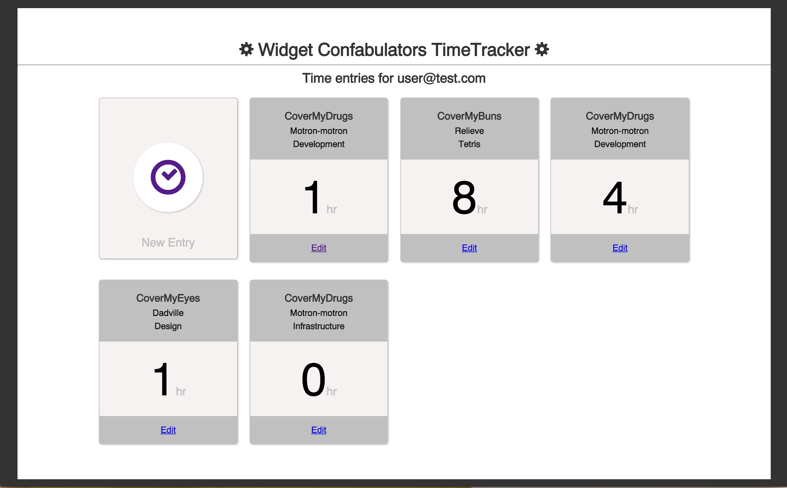

TimeTracker API
===============

Getting started
---------------
1. `bundle install`
2. `bundle exec rake db:migrate`
3. `bundle exec rake db:seed` (for test data)
4. For API docs: `bundle exec rake docs:generate`
5. Open API docs `open doc/api/index.html`

Implementation
--------------
Time entries are started and stopped by switching the `started_at` property from `nil` to a time and vice versa. This allows for
REST-like manipulation of time entries without 'start' or 'stop' methods and routes.

Task types are defined on a company basis in this implementation, it would also be perfectly valid to define them
at the top level of the app, or a mix of both as well.

JSON API
--------
The generated documentation provides most of the fine-grain detail into the requests and responses of the API,
but here are a few broad conventions:

JSON responses will be wrapped with with a root element. If you're using
[Backbone.js](http://backbonejs.org/) you might have to override the `parse`
method on your models. If you are using [Ember.js](http://emberjs.com/) you will
probably want to use the [RESTAdapter](http://emberjs.com/api/data/classes/DS.RESTAdapter.html)
and [customize the serializer](http://emberjs.com/api/data/classes/DS.RESTSerializer.html#toc_across-the-board-normalization) to user
underscores. [Angular.js](https://angularjs.org/) and [React](https://facebook.github.io/react/) should work just fine out of the box.

Rails' parameter wrapping for JSON is enabled so even though the generated
API documentation shows that the POST body need a key like this:

```json
{"project":{"name":"Test project name"}}
```

It can intead be submitted like this so that it mirrors the response:

```json
{"name":"Test project name"}
```

Authentication
--------------
The is application is using Devise for authentication: https://github.com/plataformatec/devise

Additionally it uses the `simple_token_authentication` gem which allows you to pass the user
email and token as headers or query params for authentication:

```
http://localhost:3000/companies.json?user_email=user@test.com&user_token=some_token_generated_after_seed
````
[More info here](https://github.com/gonzalo-bulnes/simple_token_authentication#usage)

HTTP basic auth is also enabled and can be passed in the header of XHR requests.

Other notes
-----------
SQLite3 and Ruby version 2.0.0 or higher required.

The test user email is "user@test.com" with a super secret password of "supersecret."
See `db/seeds.rb` for more information.
